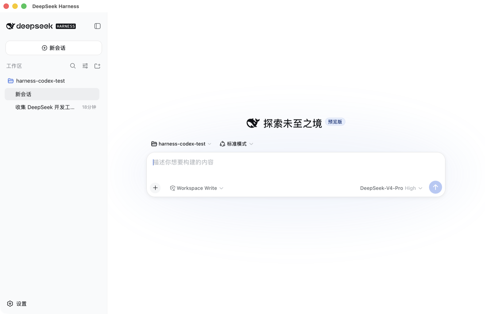
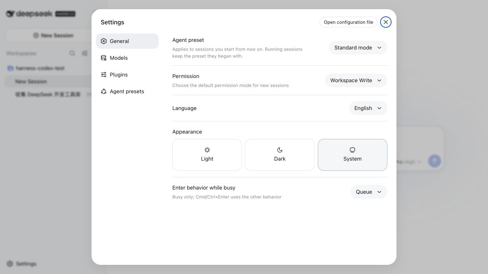
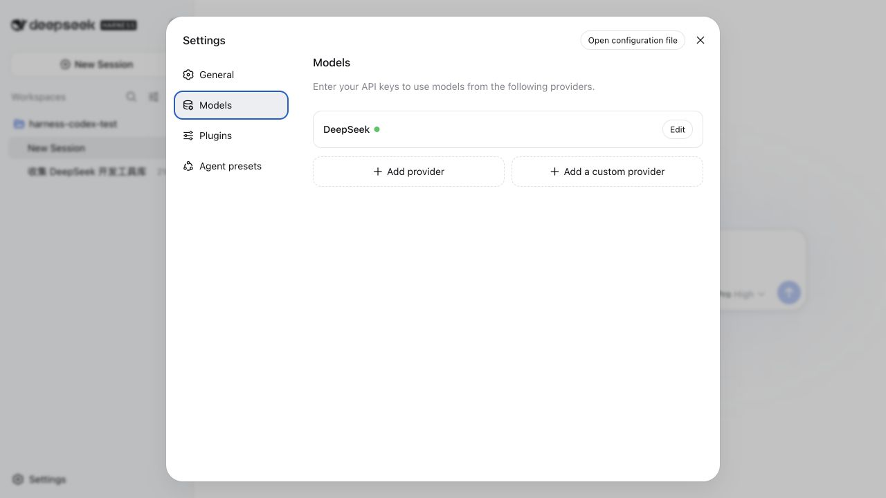
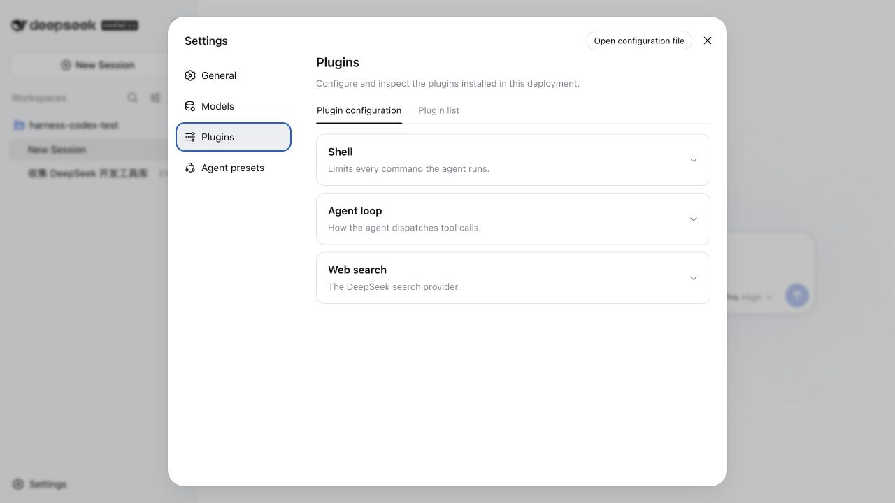
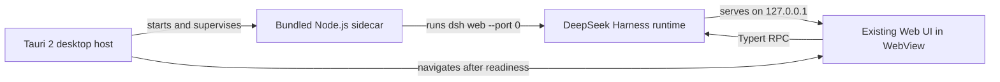

<div align="center">

# [**deepseek-harness-desktop**](https://github.com/fendouai/deepseek-harness-desktop)

### The plugin-native AI agent workspace, packaged as a real desktop app.

An independent desktop distribution of DeepSeek Harness with the complete Web UI, a supervised local sidecar, and a bundled Node.js runtime.

[](LICENSE) [](https://v2.tauri.app/) [](https://nodejs.org/) [](https://github.com/fendouai/deepseek-harness-desktop/stargazers)

English · [中文](README.zh.md) · [Download](#download) · [Quick start](#quick-start) · [Architecture](#how-it-works) · [Contributing](CONTRIBUTING.md)

</div>

<blockquote><strong>Developer preview:</strong> expect compatibility-breaking changes before the first stable release.</blockquote>

## About this project

[**deepseek-harness-desktop**](https://github.com/fendouai/deepseek-harness-desktop) packages [DeepSeek Harness](https://github.com/deepseek-ai/deepseek-harness) as a self-contained desktop application. It is maintained in this repository as an independent project and preserves the upstream Harness runtime, plugin architecture, and Web UI.

- **One app, complete runtime** — Tauri bundles the production `dsh` deployment and an official Node.js 24 executable.
- **The full Harness experience** — workspaces, sessions, settings, tools, skills, subagents, and plugin composition stay in the existing Web UI.
- **Local by design** — the sidecar listens only on `127.0.0.1` with an OS-assigned port.
- **Supervised lifecycle** — Rust starts the sidecar, waits for its readiness signal, and terminates it when the app exits.
- **Small trusted desktop layer** — the loopback UI receives no Tauri shell capability; process control stays in Rust.
- **Cross-platform build path** — bundled Node targets are defined for Apple Silicon and Intel macOS, x64 and ARM64 Linux, and x64 and ARM64 Windows.

## Desktop preview



| General settings | Model providers |
| --- | --- |
|  |  |



<a id="download"></a>

## Download

[](https://github.com/fendouai/deepseek-harness-desktop/releases/download/v0.1.0-rc.5/DeepSeek-Harness_0.1.0-rc.5_aarch64.dmg)

The developer-preview DMG supports Apple Silicon Macs (`arm64`). This build uses ad-hoc code signing and is not notarized by Apple; if macOS blocks the first launch, Control-click **DeepSeek Harness**, choose **Open**, and confirm the prompt.

- [Download DeepSeek Harness Desktop v0.1.0-rc.5](https://github.com/fendouai/deepseek-harness-desktop/releases/download/v0.1.0-rc.5/DeepSeek-Harness_0.1.0-rc.5_aarch64.dmg) (DMG, 100 MB)
- [Release notes and SHA-256 checksum](https://github.com/fendouai/deepseek-harness-desktop/releases/tag/v0.1.0-rc.5)

<a id="run"></a>

<a id="quick-start"></a>

## Quick start

<a id="run-from-source"></a>

### Build from source

Building from source requires the repository's Node.js and pnpm versions, Rust, and the [Tauri 2 platform prerequisites](https://v2.tauri.app/start/prerequisites/).

```sh
git clone https://github.com/fendouai/deepseek-harness-desktop.git
cd deepseek-harness-desktop
pnpm install
pnpm --filter dsh-desktop build
```

The macOS build, which is the currently verified desktop target, is written to:

```text
apps/desktop/src-tauri/target/release/bundle/macos/DeepSeek Harness.app
```

Run the desktop application in development mode with live process output:

```sh
pnpm --filter dsh-desktop dev
```

<a id="how-it-works"></a>

## How it works



The preparation step builds Harness and the Web frontend, creates an isolated production dependency deployment, verifies the pinned official Node.js archive with SHA-256, and gives the executable Tauri's target-specific sidecar filename. Desktop data lives under Tauri's application data directory and remains separate from the CLI's home.

The detailed runtime and cross-compilation contract lives in the [desktop application README](apps/desktop/README.md). The architectural decision is recorded in the [desktop host Agent Note](.agents/notes/implemented/architecture/2026-08-14-tauri-desktop-sidecar-host.md).

## Upstream foundation

DeepSeek Harness is powered by [Cordis](https://github.com/cordiverse/cordis), whose composition model is described in [_A Programming Paradigm for Spatiotemporal Composability_](https://github.com/cordiverse/paper). Plugins provide the model, tools, filesystem, shell, sessions, workflows, permissions, UI modules, and other capabilities; applications assemble only what they need.

The desktop host is intentionally small: product behavior continues to come from upstream-compatible Harness plugins and the existing Web UI. Start with the [architecture documentation](docs/architecture.md) to understand the runtime, or follow the [development guide](docs/development.md) to work on this repository.

## Project links

- [Repository](https://github.com/fendouai/deepseek-harness-desktop)
- [Issues](https://github.com/fendouai/deepseek-harness-desktop/issues)
- [Upstream DeepSeek Harness](https://github.com/deepseek-ai/deepseek-harness)

## Contributing

Contributions are welcome. Read [CONTRIBUTING.md](CONTRIBUTING.md) before opening a pull request. Agents working in this repository must also follow [AGENTS.md](AGENTS.md).

## License

DeepSeek Harness Desktop is available under the [MIT License](LICENSE). Third-party dependencies and their licenses are listed in [THIRD_PARTY_NOTICES.md](THIRD_PARTY_NOTICES.md).
