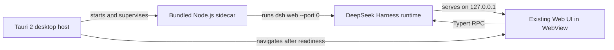

<div align="center">

# [**deepseek-harness-desktop**](https://github.com/fendouai/deepseek-harness-desktop)

### 将插件原生的 AI Agent 工作台，装进真正的桌面应用。

这是 DeepSeek Harness 的独立桌面发行项目，完整复用 Web UI，以受控本地 sidecar 运行 Harness，并内置 Node.js 运行时。

[](LICENSE) [](https://v2.tauri.app/) [](https://nodejs.org/) [](https://github.com/fendouai/deepseek-harness-desktop/stargazers)

[English](README.md) · 中文 · [快速开始](#quick-start) · [运行原理](#how-it-works) · [参与贡献](CONTRIBUTING.md)

</div>

<blockquote><strong>开发者预览：</strong>首个稳定版本发布前可能出现破坏兼容性的变更。</blockquote>

## 关于本项目

[**deepseek-harness-desktop**](https://github.com/fendouai/deepseek-harness-desktop) 将 [DeepSeek Harness](https://github.com/deepseek-ai/deepseek-harness) 封装为自包含桌面应用。本仓库将其作为独立项目维护，同时保留上游 Harness 运行时、插件架构和 Web UI。

- **一个应用，完整运行时** —— Tauri 内置生产版 `dsh` 部署和官方 Node.js 24 可执行文件。
- **完整 Harness 体验** —— 工作区、会话、设置、工具、技能、subagent 和插件组合继续由现有 Web UI 提供。
- **本地优先** —— sidecar 仅监听 `127.0.0.1`，端口由操作系统分配。
- **受控生命周期** —— Rust 启动 sidecar、等待就绪信号，并在应用退出时终止进程。
- **精简的可信桌面层** —— 回环地址加载的 UI 不具备 Tauri shell 权限，进程控制只存在于 Rust 中。
- **跨平台构建路径** —— 内置 Node 目标覆盖 Apple Silicon 与 Intel macOS、x64 与 ARM64 Linux，以及 x64 与 ARM64 Windows。

## 桌面界面预览


| 通用设置 | 模型提供方 |
| --- | --- |
|  |  |


<a id="run"></a>

<a id="quick-start"></a>

## 快速开始

<a id="run-from-source"></a>

### 从源码构建

从源码构建需要仓库指定的 Node.js 与 pnpm 版本、Rust，以及 [Tauri 2 平台依赖](https://v2.tauri.app/start/prerequisites/)。

```sh
git clone https://github.com/fendouai/deepseek-harness-desktop.git
cd deepseek-harness-desktop
pnpm install
pnpm --filter dsh-desktop build
```

macOS 是当前已经验证的桌面目标，应用生成于：

```text
apps/desktop/src-tauri/target/release/bundle/macos/DeepSeek Harness.app
```

在开发模式下运行桌面应用并查看实时进程输出：

```sh
pnpm --filter dsh-desktop dev
```

<a id="how-it-works"></a>

## 运行原理



准备步骤会构建 Harness 与 Web 前端，创建隔离的生产依赖部署，通过 SHA-256 校验固定版本的官方 Node.js 归档，并按照 Tauri 目标命名 sidecar。桌面数据存放在 Tauri 应用数据目录中，与 CLI 主目录隔离。

运行时与交叉编译约定详见[桌面应用 README](apps/desktop/README.md)。架构决策记录于[桌面宿主 Agent Note](.agents/notes/implemented/architecture/2026-08-14-tauri-desktop-sidecar-host.md)。

## 上游基础

DeepSeek Harness 由 [Cordis](https://github.com/cordiverse/cordis) 驱动，其组合模型参见论文 [_A Programming Paradigm for Spatiotemporal Composability_](https://github.com/cordiverse/paper)。模型、工具、文件系统、shell、会话、工作流、权限、UI 模块及其他能力均由插件提供；应用只组合自身需要的部分。

桌面宿主刻意保持精简：产品行为继续由兼容上游的 Harness 插件与现有 Web UI 提供。如需理解运行时，请先阅读[架构文档](docs/architecture.md)；如需参与本仓库开发，请阅读[开发指南](docs/development.md)。

## 项目链接

- [项目仓库](https://github.com/fendouai/deepseek-harness-desktop)
- [问题反馈](https://github.com/fendouai/deepseek-harness-desktop/issues)
- [上游 DeepSeek Harness](https://github.com/deepseek-ai/deepseek-harness)

## 参与贡献

欢迎参与贡献。提交 pull request 前请阅读 [CONTRIBUTING.md](CONTRIBUTING.md)。在本仓库工作的 agent 还必须遵循 [AGENTS.md](AGENTS.md)。

## 许可证

DeepSeek Harness Desktop 采用 [MIT 许可证](LICENSE)。第三方依赖及其许可证见 [THIRD_PARTY_NOTICES.md](THIRD_PARTY_NOTICES.md)。
